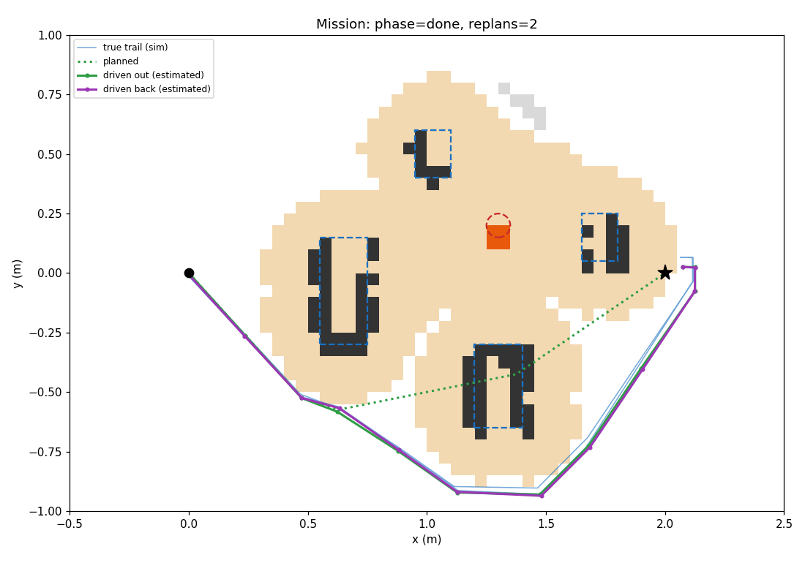

> 🤖 **CLAUDE VERSION**: modified by Claude (Anthropic), not Codex. See [CLAUDE_CHANGES.md](CLAUDE_CHANGES.md).

# Fire-Avoidance Rescue Robot

Elegoo Smart Robot Car V4.0 + Raspberry Pi 4 + RealSense D435.
The car scans an area, maps obstacles and a flame prop, plans the shortest safe
path to a goal with A*, drives it, then retraces it home, re-checking each leg
with the camera before driving it.

The Pi does all mapping and decisions. The Uno just drives motors, pans the
camera, reads the gyro, and runs an independent ultrasonic safety stop.



## Layout
```
firmware/uno_driver/   Uno sketch (serial motor driver, gyro, pan servo, sonar stop)
pi/
  run_mission.py       the whole mission (real car, or --sim on a laptop)
  test_drive.py        first hardware test: forward, stop, spin
  d435_check.py        does the D435 work? + floor/pitch fit + flame color tuning
  calibrate.py         measure drive speed and spin rate -> config.json
  rescue/              the package
    uno_link.py        serial protocol wrapper (keepalive, events)
    base.py            turn / move / pan on the real car (gyro-closed-loop)
    perception.py      D435 depth -> floor/obstacle/flame points
    grid.py            occupancy grid + safety margins
    astar.py           A* + path smoothing
    mission.py         scan -> plan -> drive -> retrace with re-checks
    sim.py             fake car + camera for laptop testing
    telemetry.py       UDP JSON to the laptop viewer
    config.py          every tunable number, overridable by config.json
  tests/               pytest, no hardware needed
laptop/viewer.py       live map on the demo laptop
```

## Try it without hardware
```sh
cd pi
pip install numpy matplotlib pytest opencv-python-headless pyserial
python3 run_mission.py --sim --plot sim.png     # add --seed N to vary the noise
python3 -m pytest -q
```

## Bring-up order on the real car
Test each piece alone before combining (Phase 7 of the build plan).

1. **Firmware.** Upload `firmware/uno_driver` (Arduino IDE, board: Arduino Uno; needs the Servo library).
   - Keep the car **still for ~1 s after reset**. The gyro measures its zero offset then.
   - Serial Monitor at 115200, Newline line ending. Check that `P` → `OK`, `D` → distance, and `H` → heading.
2. **Motors, wheels up.**
   - `F 120`: all four wheels forward, stopping after 0.5 s (watchdog).
   - `M 120 0`: left wheels only. `M 0 120`: right wheels only.
3. **Gyro sign.** Send `L 120`, then `S`, then `H`. The heading should have gone **up** (left turn = positive). If it went down, set `"imu_sign": -1` in `pi/config.json`.
4. **Pan servo.** `V 150` should turn the camera **left**. If it turns right, set `"pan_sign": -1`.
5. **Pi serial.** `python3 pi/test_drive.py`.
6. **Calibrate** on the demo surface: `python3 pi/calibrate.py`.
7. **Camera.** Run `python3 pi/d435_check.py`.
   - `--floor`, aimed at open floor, prints `cam_height_m` and `cam_pitch_deg` for config.json.
   - `--flame`, aimed at the prop, saves the mask images. Adjust `flame_hsv` until only the flame is white.
8. **Mission.**
   - On the laptop: `python3 laptop/viewer.py`.
   - On the Pi: `python3 pi/run_mission.py --goal 2.0 0 --telemetry <laptop-ip>`.

Put the car at the start pointing at the goal area. The goal is in meters: x ahead, y to the left.

## Serial protocol
115200 baud, ASCII, one command per line (`\n`), one reply line per command.
The Uno prints `READY` at boot; opening the port resets it, so wait for that first.

| Command | Meaning | Reply |
|---|---|---|
| `M <left> <right>` | Tank drive, signed PWM -255..255 per side | `OK` |
| `F <spd>` / `B <spd>` | Forward / back, both sides | `OK` |
| `L <spd>` / `R <spd>` | Spin left / right in place | `OK` |
| `S` | Stop | `OK` |
| `D` | Latest ultrasonic reading | `D <cm>` (`-1` = nothing in range) |
| `H` | Gyro heading since boot, centidegrees | `H <cdeg>` or `ERR NO_IMU` |
| `V <deg>` | Camera pan servo, 0..180 (90 = ahead) | `OK` |
| `P` | Ping / keepalive | `OK` |
| bad input | — | `ERR ARGS`, `ERR UNKNOWN`, `ERR TOO_LONG` |

The Uno may also send these lines at any time:
- `E STOP_OBSTACLE <cm>`: it stopped because something is closer than 15 cm while moving forward.
- `E WATCHDOG`: it stopped because no command arrived for 500 ms.

Safety rules in the firmware:
- |PWM| < 30 is treated as 0.
- While the ultrasonic sees something under 15 cm (two readings in a row), forward drive is refused with `ERR BLOCKED <cm>`. Reverse and spin still work, so the Pi can back out.
- While moving, some command must arrive every 500 ms. `UnoLink` handles this.

## How the mission stays safe
- **Margins.** Obstacles are grown by the robot's radius plus clearance (18 cm). The flame gets 10 cm more. Unseen space just behind a detected obstacle is assumed solid (15 cm), because the camera only sees front faces.
- **Look before every leg.** This happens on both legs, not only the return: the flame can be hidden behind a box at the start. If the next leg is no longer clear, the car replans.
- **Tight spots.** If no path fits, it retries with smaller clearance (never smaller than the robot itself). If margins cover the goal, it stops at the nearest safe point within 10 cm.
- **Heading from the gyro.** Turns stop on the measured angle, and straight moves steer to hold heading. In the sim this is the difference between ending within 10 cm of the start and ending up to 35 cm off.

## Known limits
- Distance is still timed, with no wheel encoders. Expect a few percent error per meter. Recalibrate on the demo surface.
- The map area is bounded (`x_min`..`y_max` in config). On a tabletop, set the bounds inside the table edge: out-of-map counts as blocked.
- The D435 can't see closer than about 20 cm, and the ultrasonic only looks straight ahead.

## Running in NVIDIA Isaac Sim 6.1 (added by Claude)

Needs a Linux or Windows PC with an NVIDIA RTX GPU and Isaac Sim 6.1 installed
(below, `~/isaacsim` is the install folder; on Windows use `python.bat`).

```bash
git clone <your repo> fire-robot && cd fire-robot
~/isaacsim/python.sh -m pip install opencv-python-headless matplotlib   # once
~/isaacsim/python.sh -m pytest pi/tests                                  # sanity check
~/isaacsim/python.sh pi/run_isaac.py --keep-open                         # GUI
~/isaacsim/python.sh pi/run_isaac.py --headless --plot isaac.png         # no window
```

Isaac renders the D435's color and depth images, and they go through the same perception
code as the real camera. Motion error, sonar and collision counting come from `rescue/sim.py`.
If the flame isn't detected, run with `--save-frames frames` and compare `*_rgb.png` with
`*_flame.png`, then adjust `flame_hsv` in a `config.json`.
